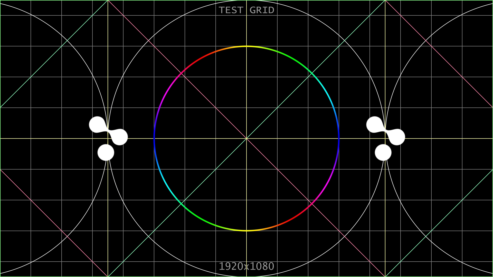

# td-grid-comp

#### TouchDesigner version 2022.32120

License: MIT

[Matthew Wachter](https://www.matthewwachter.com)

[VT Pro Design](https://www.vtprodesign.com)

## Description
A TouchDesigner component that can be used to create a grid of any size. Implemented in GLSL primarily with SDF functions found here:

[IQ - 2D SDFs](https://iquilezles.org/articles/distfunctions2d/)

This component offers a rich array of parameters for fine-tuning the visual aesthetic of your grids.
